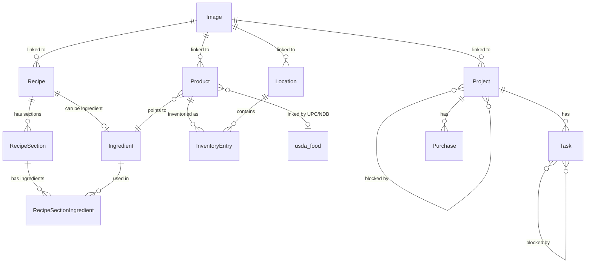

# 🥡 cubby

Recipe database and home inventory database, tied together. A personal pantry-and-cooking system: track what you own, where it lives, what it cost, and what you can cook with it.

## 🎯 Why Cubby

Cubby is a personal system — built for my own household, not a product for strangers. Its north-star is the **recipe ↔ inventory tie**: knowing what I can actually cook from what I physically own, where it lives, and what it costs. Most tools do recipes *or* a pantry list; Cubby joins the two, so *"what can I make tonight, and what would it cost?"* becomes a query instead of a guess.

It's three things at once: an earnest daily-use home utility, a playground for a modern stack (TanStack Start, Cloudflare Workers, Rust/WASM, agentic AI), and a place to hold a high engineering bar on something I actually use.

**Cubby is _not_:**

- A **multi-tenant SaaS** — no public sign-ups, billing, or tenant-isolation work
- **Cross-platform** — mobile is iOS-only by design
- A **social app** — no feeds, public recipe sharing, or community
- A **commerce tool** — no in-app buying, ordering, or cross-store price-shopping

## ✨ Capabilities

**Inventory**
- Add/edit/move inventory items across hierarchical locations
- Barcode scan for quick capture (mobile-optimized)
- Bulk edit and move
- Gallery, table, and visualization (treemap, sunburst) views

**Products**
- Specific items (UPC, manufacturer, price, nutrition) or `misc:` placeholders
- Multi-unit mappings (volume ↔ weight ↔ price) for cross-unit conversions
- Optional link to an ingredient and to a USDA food entry

**Recipes**
- Multi-section recipes with nested ingredients
- Ingredients can be other recipes (composition)
- Side-by-side recipe comparison
- Cost rollups via product unit mappings

**USDA**
- Full USDA FoodData Central database loaded into a sibling service
- Browse, search, and link products by UPC or NDB code

**Locations**
- Tree structure (house → room → shelf → bin)
- Interactive graph, treemap, sunburst views
- Printable QR-code shortcode labels

**Images**
- S3/R2-backed image upload with presigned URLs
- Linked to products, locations, recipes, or projects

**Project Tracker**
- Household projects, tasks, and purchases (the spend ledger) — migrated from Notion into first-class entities
- Blocked-by dependency edges between projects and between tasks
- Dashboard with overview/charts/data/gallery views (spending, timelines, task heatmaps, dependency graph)
- Detail pages with full inline editing, markdown notes, and image galleries
- First-class inline links/hovercards, global + semantic search, full MCP CRUD

**Analytics**
- Donut, treemap, sunburst, and network visualizations across products, inventory, and ingredients
- Category audits + data-problem detection

**Auth & Audit**
- Better-Auth sign-up/login with API keys
- Activity log across all entities
- Soft delete on all major entities (no restore — by design)

**Mobile (PWA, iOS)**
- Installable PWA with splash screens
- Touch-friendly cards and immersive barcode scanner
- App-shell offline fallback with precached styles, fonts, and recipe WASM
- *Offline data/mutation sync and swipe gestures remain planned — see [Roadmap](#-roadmap)*

## 🧱 Tech Stack

- **App:** TanStack Start (Router + Server) · React · TailwindCSS · shadcn/ui
- **API:** tRPC + TanStack Query
- **Data:** Drizzle ORM · PostgreSQL · Hyperdrive (edge pool)
- **Auth:** Better-Auth (`@daveyplate/better-auth-ui` for routed UI)
- **Edge:** Cloudflare Workers + Wrangler
- **WASM:** `@cubby/recipebridge` wraps Rust [ingredient-parser](https://github.com/nickysemenza/ingredient-parser)
- **Storage:** Cloudflare R2 (S3-compatible) for images
- **Charts:** Nivo (bar, pie, treemap, sunburst, calendar, line) + d3-force, d3-hierarchy
- **Tooling:** Biome (lint + format) · Vitest (unit/integration) · Playwright (E2E) · IntegresQL (test DB isolation)
- **Observability:** OpenTelemetry → Jaeger (dev only) · Sentry

## 📦 Monorepo Layout

### Apps (deployed)

| Path | Package | Role | Runtime | Deploys to |
|---|---|---|---|---|
| [apps/web](apps/web) | `@cubby/web` | Main app — TanStack Start + tRPC + Drizzle | Cloudflare Workers | Worker `cubby` · DB via **Hyperdrive** → Postgres |
| [apps/upc-lookup](apps/upc-lookup) | `@cubby/upc-lookup` | UPC barcode lookup API — Hono + D1 | Cloudflare Workers | Worker `upc-lookup` · <https://upc-lookup.nicky.workers.dev> |
| [apps/usda-api](apps/usda-api) | `@cubby/usda-api` | USDA FoodData Central API — Hono + D1/R2 bundles | Cloudflare Workers | Worker `usda-api` · <https://usda-api.nicky.workers.dev> · D1 search index + R2 NDJSON payload bundles |

### Packages (internal, not deployed)

| Path | Package | Role | Consumed by |
|---|---|---|---|
| [packages/wasm](packages/wasm) | `@cubby/recipebridge` | WASM bindings — built from `recipebridge/` Rust source via `pnpm run wasm` | `web` |
| [packages/upc-contract](packages/upc-contract) | `@cubby/upc-contract` | Shared UPC request/response transport contract | `web`, `upc-lookup`, `schemas` |
| [packages/usda-contract](packages/usda-contract) | `@cubby/usda-contract` | ts-rest endpoint contract for the USDA API | `web`, `usda-api` |
| [packages/usda-schemas](packages/usda-schemas) | `@cubby/usda-schemas` | Shared Zod schemas for USDA entities | `web`, `usda-api` |
| [packages/schemas](packages/schemas) | `@cubby/schemas` | Cross-app Zod schemas | `web` |
| [packages/shared](packages/shared) | `@cubby/shared` | Shared utilities, including guarded external fetches | `web`, `upc-lookup` |
| [packages/worker-tracing](packages/worker-tracing) | `@cubby/worker-tracing` | Cloudflare Worker tracing/Sentry bootstrap | all three Workers |
| [recipebridge/](recipebridge) | (Rust source) | Source for the ingredient-parser WASM shim | Built into `packages/wasm` |

## 🏗️ Architecture

Request flow:

```
Router (tRPC)  →  Service (optional, enrichment only)  →  Repo (data access)  →  Database
```

- Routers use the CRUD factory (`createEntityCrudProcedures` from `crud-factory.ts`) for standard CRUD operations.
- Services exist only when entities need enrichment (e.g., USDA food data). Otherwise routers call repos directly.
- The `Database` type is **opaque** — only repos can call `getDb(db)` to unwrap it. This enforces the layered architecture at the type level.

See [CLAUDE.md](CLAUDE.md) for the prescriptive rules (branded IDs, soft delete, required helpers, React hooks pitfalls).

## 🗂️ Entities

**Recipes** have multiple sections, each of which has **Ingredients** and an amount. Ingredients can also be other recipes.

**Products** have multiple unit mappings (each of which contain 2 amounts). Products can also point to an ingredient.

**USDA Food** database is loaded, loosely linked to products based on the products NDB number or UPC code.

Products can be inventoried — an **Inventory Entry** specifies the amount of a given **Product** at a given **Location**.

The household **Project Tracker** (migrated from Notion) is its own self-contained module: a **Project** groups **Tasks** and **Purchases** (the spend ledger), with blocked-by/blocking dependency edges between projects and between tasks. Spend/progress rollups are SQL aggregates — never denormalized. Project `locations` is deliberately free-form `text[]` (house names live in data, not committed enums).



## 🛠️ Development Setup

Prereqs: **Node** (see [.nvmrc](.nvmrc), currently `v24`), **pnpm** (pinned in [package.json](package.json) — `packageManager: pnpm@10.34.1`), **Docker**, **wrangler** (for CF Workers work).

```sh
# 1. Install
pnpm install

# 2. Env
cp apps/web/.env.example apps/web/.env
# Edit apps/web/.env — see "Environment Variables" below

# 3. Local services (Postgres 17 + IntegresQL + Jaeger)
docker-compose up -d

# 4. Web DB schema
pnpm --filter @cubby/web run db:push

# 5. Build the WASM shim (one-time, or whenever recipebridge/ changes)
pnpm run wasm

# 6. Dev server
pnpm run dev
```

App: <http://localhost:3000> · Jaeger: <http://localhost:16686>

### Environment Variables

Required keys (see [apps/web/.env.example](apps/web/.env.example) for the full file):

| Key | Purpose |
|---|---|
| `BETTER_AUTH_SECRET` | Auth signing secret |
| `DATABASE_URL` | PostgreSQL connection (defaults to local docker-compose) |
| `R2_ACCESS_KEY_ID` / `R2_SECRET_ACCESS_KEY` / `R2_ENDPOINT` / `R2_BUCKET_NAME` / `R2_PUBLIC_URL` | Image storage |
| `USDA_API_URL` | USDA service URL (defaults to `http://localhost:8787/` for local Wrangler dev) |
| `UPC_LOOKUP_API_URL` / `UPC_LOOKUP_API_KEY` | UPC lookup worker |
| `NOTION_API_KEY` | *(optional)* Notion recipes import |
| `OTEL_EXPORTER_OTLP_ENDPOINT` | *(optional)* OTLP traces → Jaeger |

### Worktrees (parallel sessions)

Claude Code can run parallel sessions, each in its own git worktree under
`.claude/worktrees/<name>`. A few things to know:

- **Fresh worktree setup:** `pnpm install && pnpm run wasm`. Gitignored env
  (`apps/web/.env`, `.env.local`) is copied in automatically via
  [.worktreeinclude](.worktreeinclude); `node_modules` and the gitignored WASM
  package (`packages/wasm/*`) are not, so build them once.
- **Builds are shared, not cold.** The `wasm` script points `CARGO_TARGET_DIR` at a
  shared cache (`~/.cache/cubby/recipebridge-target`), so worktrees reuse the
  compiled Rust deps — a worktree `pnpm run wasm` is an incremental build, not the
  ~90s cold one, and there's no 1.3GB `target/` per worktree.
- **WASM never silently drifts.** [scripts/ensure-wasm.mjs](scripts/ensure-wasm.mjs)
  rebuilds the gitignored WASM only when a source it's built from is newer than the
  built binary. "Sources" is `recipebridge/` **plus every local path-dependency**
  `cargo metadata` reports (`source: null`) — notably the
  [ingredient-parser](https://github.com/nickysemenza/ingredient-parser) working
  copy the global `~/.cargo` `[patch]` redirects to, so editing the parser locally is
  caught too (no patch → only `recipebridge/`, same as CI). It runs on `pnpm dev`
  (so a local parser edit rebuilds on the next dev start) and on `git pull`/`git
  checkout` (husky `post-merge`/`post-checkout`, for a pulled rev bump or branch
  switch) — on the **main** checkout too. cargo does the real incremental compile;
  this is just the staleness gate that skips the ~10s wasm-bindgen/opt when fresh.
- **Ports.** The main checkout is always `:3000` (`vite.config.ts` uses `strictPort`,
  so it fails loudly rather than drifting). Worktree dev servers auto-pick a free
  port — the preview harness via `autoPort` (injects `PORT`), or a terminal
  `pnpm dev` via vite's auto-increment.
- **Previewing a worktree:** start a session with the **worktree folder itself**
  selected as the project (`<repo>/.claude/worktrees/<name>`), not by entering a
  worktree from inside the main-rooted session — preview resolves `launch.json` from
  the folder you opened, so opening the worktree serves its branch.
- **Shared services:** docker-compose (Postgres/IntegresQL/Jaeger) binds fixed host
  ports — `docker-compose up -d` once from any checkout and all worktrees reuse them
  for `test`/`test:e2e`.
- **⚠ Shared prod DB:** every worktree's `DATABASE_URL` is the **same prod Neon**
  instance (dev DB *is* prod). `db:push` and data changes from one worktree are
  visible everywhere and hit prod — coordinate schema changes across parallel work.
- Editing `recipebridge/` Rust source — or the patched sibling ingredient-parser
  checkout — is picked up automatically on the next `pnpm dev` (see "WASM never
  silently drifts" above); `pnpm run wasm` forces it. Needs the rust toolchain + the
  global cargo patch + the sibling ingredient-parser checkout.

## ⚡ Common Commands

| Command | What it does |
|---|---|
| `pnpm run dev` | Start the web, UPC, and USDA local services |
| `pnpm run build` | Build all three production Worker bundles |
| `pnpm run check` | Biome (zero warnings), both TypeScript engines, Worker/OpenAPI drift, Knip, dedupe, audit policy, and conventions |
| `pnpm run typecheck` | Recursive package typecheck with `tsgo` (TS 7.0 preview, fast) |
| `pnpm run typecheck:stable` | Recursive package typecheck with stable TypeScript (fallback) |
| `pnpm run lint` | Recursive package Biome lint |
| `pnpm run format:check` | Recursive package Biome format/lint check |
| `pnpm run format:write` | Recursive package Biome auto-fix |
| `pnpm run test` | Recursive non-watch Vitest unit + integration |
| `pnpm run test:e2e` | Playwright E2E (uses IntegresQL) |
| `pnpm --filter @cubby/web run db:push` | Push the web Drizzle schema to the configured Postgres DB |
| `pnpm --filter @cubby/web run build:cf` | Build only the main web Worker |
| `pnpm --filter @cubby/web run preview:cf` | Run the Workers build locally |
| `pnpm --filter @cubby/web run deploy:cf` | Deploy to Cloudflare Workers |
| `pnpm run wasm` | Rebuild `@cubby/recipebridge` from Rust source |

The auxiliary Workers (`@cubby/upc-lookup` and `@cubby/usda-api`) are included in
recursive checks/tests. Their D1 databases do not use the web `db:push` workflow:
generate/apply their D1 migrations locally first, run the package checks, then apply
remote D1 migrations before deploying code that depends on the new schema. Use staged
expand/migrate/deploy/cleanup changes for incompatible D1 schema changes.

Temporary upstream pins, peer-range exceptions, and transitive deprecation
rationales are tracked in [docs/dependency-exceptions.md](docs/dependency-exceptions.md).

In dev, `await __jsProfile(5000)` in the browser console captures a CPU flame summary (the hottest main-thread frames over the next N ms) — it catches "every measurement is fast but the page is slow" jank that React's profiler can't see (commit-phase / native / third-party work).

## 🧪 Testing

| Suffix | Purpose | Runner |
|---|---|---|
| `*.unit.test.ts` | Unit tests | Vitest |
| `*.integration.test.ts` | Integration tests (real DB via IntegresQL) | Vitest |
| `*.spec.ts` | E2E tests | Playwright |

E2E tests use IntegresQL to spin up fresh databases per test — see memory notes for SSR hydration gotchas and the `e2e-helpers.ts` shared helpers.

### File Naming Conventions

| Pattern | Example | Used For |
|---|---|---|
| `*.service.ts` | `product.service.ts` | Service layer (enrichment) |
| `*-helpers.ts` | `database-helpers.ts` | Utility helpers |
| `*-utils.ts` | `location-utils.ts` | Utility functions |
| `types.ts` / `internal-types.ts` | `repo/product/types.ts` | Local type definitions |

## 🚀 Deployment — `apps/web` on Cloudflare Workers

What deploys where lives in the [Monorepo Layout](#-monorepo-layout) table. This section covers the non-trivial internals of the main app's CF Workers deploy. (`upc-lookup` and `usda-api` are also Cloudflare Workers.)

The dev server is plain Node via `vite dev`. Production = CF Workers.

| File | Purpose |
|---|---|
| [apps/web/src/cf-server.ts](apps/web/src/cf-server.ts) | Worker entry — wraps each request with `withRequestDb()` |
| [apps/web/src/server/db.ts](apps/web/src/server/db.ts) | Per-request `pg.Pool` via `AsyncLocalStorage` (CF) or module-level pool (dev) |
| [apps/web/src/lib/recipebridge-cf.ts](apps/web/src/lib/recipebridge-cf.ts) | WASM wrapper using `?init` pattern for CF |
| [apps/web/wrangler.jsonc](apps/web/wrangler.jsonc) | Worker config (name, vars, Hyperdrive, compat flags) |
| [apps/web/vite.config.ts](apps/web/vite.config.ts) | `cfWasmPlugin()` + `__CF_WORKERS__` define for dead-code elimination |

Key constraints:

- **Hyperdrive** pools TCP connections at CF's edge. The connection string comes from `env.HYPERDRIVE.connectionString` (not a secret).
- **Per-request `pg.Pool`** (`max: 5`) via `withRequestDb()` + `AsyncLocalStorage`. A single `pg.Client` would serialize a request's query fan-out on one connection; a small pool lets independent queries run in parallel. `max: 5` is the Workers per-invocation connection ceiling (~6 simultaneous outbound TCP), distinct from Hyperdrive's 60-connection origin pool shared across all invocations.
- **Hyperdrive query caching is ON** — read queries are cached at the CF edge (~4ms PoP hit vs a us-west-2 round trip), which also relieves Neon's egress cap. This is **account-level config on the Hyperdrive object, not expressible in `wrangler.jsonc`** (the binding only holds `binding` + `id`). It's set via the dashboard or, reproducibly:
  ```sh
  wrangler hyperdrive update adc9757dfffd45bc94d5c2a66b2ad410 --max-age 60 --swr 15
  ```
  Caveats: only SELECTs **outside** an explicit transaction are cached (so keep hot list reads out of `withTransaction`), and queries containing STABLE functions (`NOW()`/`CURRENT_DATE`) are uncacheable — repo reads pass `new Date()` as a bound param, so they stay cacheable.
- **WASM uses `?init`** because `vite-plugin-wasm` doesn't apply to CF's SSR environment. `cfWasmPlugin()` redirects `@cubby/recipebridge` to `recipebridge-cf.ts`.
- **`__CF_WORKERS__` define** eliminates module-level Pool creation from the CF build.
- **OTel disabled in production** — only runs in dev via `instrument.server.mjs`.
- Secrets via `wrangler secret put BETTER_AUTH_SECRET` (etc.) — see `wrangler.jsonc` for the full list.

## 🔐 Authentication

Better-Auth via `better-auth/tanstack-start`. Routed UI by `@daveyplate/better-auth-ui`.

| File | Purpose |
|---|---|
| [apps/web/src/lib/auth.ts](apps/web/src/lib/auth.ts) | Server config |
| [apps/web/src/lib/auth-client.ts](apps/web/src/lib/auth-client.ts) | Client (`useSession` and friends) |
| [apps/web/src/routes/api/auth/$.ts](apps/web/src/routes/api/auth/$.ts) | API catch-all route |
| [apps/web/src/routes/auth.$authView.tsx](apps/web/src/routes/auth.$authView.tsx) | Auth UI (sign-in/up) |
| [apps/web/src/routes/_authenticated/account.$accountView.tsx](apps/web/src/routes/_authenticated/account.$accountView.tsx) | Account UI |

Visit <http://localhost:3000/api/auth/session> while running the app to inspect the current session.

## 🥫 Product Types

| Type | Example | Characteristics |
|---|---|---|
| **Specific Item** | "Kraft Macaroni & Cheese" | Has UPC, manufacturer, price, nutrition. Created via barcode scan. |
| **Misc Collection** | `misc:random cables` | Opaque placeholder. Just a name, no details. Prefix with `misc:`. |

## ⚖️ Unit Conversion (WASM)

- `@cubby/recipebridge` wraps Rust WASM from [ingredient-parser](https://github.com/nickysemenza/ingredient-parser).
- Client-side: `wasm` from `~/lib/wasm` (sync).
- Server-side: `wasmServer` (async, auto-initializing).
- Supports **chained conversions** via graph algorithms — e.g. `2 cups → $5.00 → 333g` using a product's unit mappings.

## 🥕 USDA Integration

- **Contract:** `@cubby/usda-contract` defines endpoints with Zod schemas (ts-rest).
- **Schemas:** `@cubby/usda-schemas` for shared entity types.
- **Client:** [apps/web/src/server/clients/usda.ts](apps/web/src/server/clients/usda.ts) wraps the ts-rest client.
- **Router:** [apps/web/src/server/api/routers/usda.ts](apps/web/src/server/api/routers/usda.ts).
- Service layer processes USDA portion data through WASM for conversions.

```ts
usdaClient.findFood({ kind: "upc", gtin_upc: "123456789012" });
usdaClient.findFood({ kind: "ndb", ndb_number: 12345 });
usdaClient.listFoods(nameFilter, dataTypeFilter, sort, pagination);
usdaClient.getFoodSummaryByID(fdcId);
```

## 🗺️ Roadmap

Framed as **Now / Next / Later** (no dates — it's a personal project). Canonical plans live in [docs/plans/](docs/plans/); the links are pointers, not summaries, so they don't rot.

### Recently shipped

- **Project tracker migration + maturation** — the household projects/tasks/purchases databases moved from Notion into first-class cubby entities (DB tables, full CRUD UI at `/projects` `/tasks` `/purchases`, MCP tools, dashboard + charts). Follow-ups consolidated the entities onto shared helpers and the entity manifest, added detail pages with full editing UI, wired all three into global search + semantic embeddings, and made them first-class in inline links/hovercards (with mobile dialogs). The one-time import script was removed post-cutover (recoverable from git history).
- **Meal planning v1** — plan recipes onto a calendar (week + table views), scale each per meal, and a display-only shopping list (aggregated need vs. on-hand inventory, with a per-meal breakdown). Cook-and-consume inventory deduction was deliberately scoped out — it lives under *Meal planning v2* below → [docs/todos.md](docs/todos.md)

### Now

- _Nothing active — next focus will be promoted from **Next** below._

### Next

- **Household ERP** — deepen the project tracker from a Notion replacement into a planning system: ranged estimate purchases (a planned purchase carries a cost *range*, e.g. "electrical, $50–70k"), a purchase ↔ product/inventory bridge (bought tools/materials become trackable inventory + price observations), and maintenance/budgeting (recurring tasks, inbox tasks, planned-vs-actual budget views, Problems detectors) → [docs/plans/2026-07-18-household-erp-roadmap.md](docs/plans/2026-07-18-household-erp-roadmap.md)
- **AI deepening** — smarter Ask Cubby and better photo capture, building on the shipped *"what can I make tonight?"* (`find_cookable_recipes`) tool → [docs/todos.md](docs/todos.md)
- **Nutrition & cost intelligence** — price-per-nutrient, daily-value %, and nutrient-density comparisons via WASM conversion extensions → [docs/todos.md](docs/todos.md)

### Later

- **Meal planning v2** — cook-and-consume inventory deduction (Phase 4), expiration-aware suggestions, FEFO consumption, meal templates, nutrition goals
- **WASM deep cuts** — batch recipe parsing, custom unit aliases, inventory depletion preview
- **Location drag-drop** in the tree view
- **Engineering backlog** — document test-placement criteria; persist scraped/Notion hero images on the server import path

## 📚 Further Docs

- [CLAUDE.md](CLAUDE.md) — agent rules, anti-patterns, required helpers
- [docs/style-guide.md](docs/style-guide.md) — Tailwind/CSS conventions
- [docs/todos.md](docs/todos.md) — work list
- [docs/plans/](docs/plans/) — design docs for in-progress / upcoming features
- [docs/terminology.md](docs/terminology.md) — glossary disambiguating UI / code / DB names per concept
- [docs/inventory-audit.md](docs/inventory-audit.md) — inventory audit/session flow: purpose, current behavior, known gaps, redesign direction
