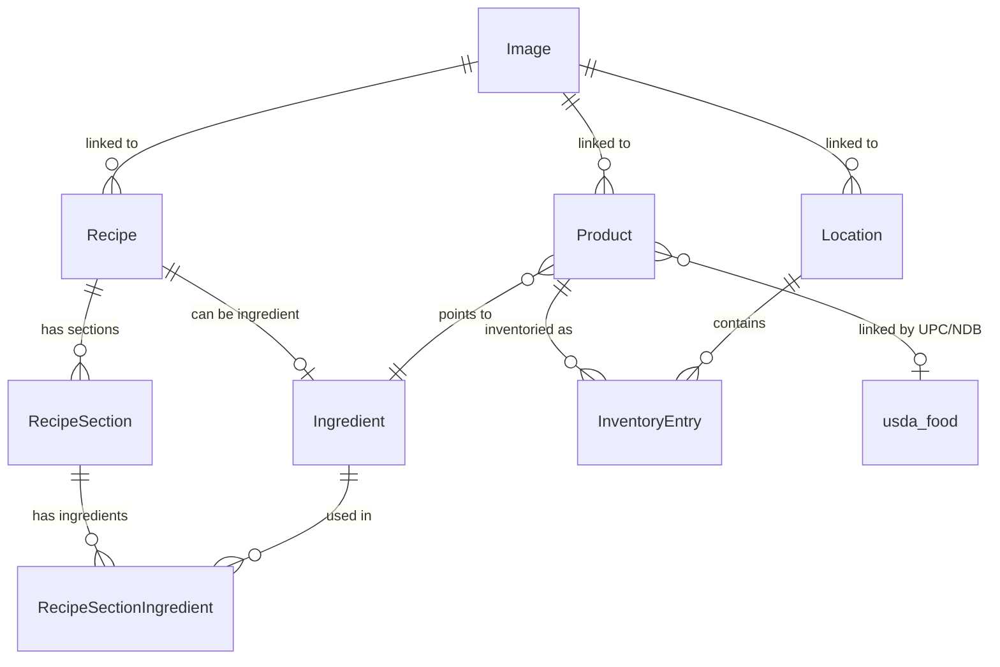

# Recipehub

Recipehub is both a recipe database and a home inventory database tied together.
Main technologies: Next.js, React w/ TailwindCSS, tRPC w/ React Query, and Drizzle ORM (PostgreSQL)

# Entities

**Recipes** have multiple sections, each of which has **Ingredients** and an amount. Ingredients can also be other recipes.

**Products** have multiple unit mappings (each of which contain 2 amounts). Products can also point to an ingredient

**USDA Food** database is loaded, loosely linked to products based on the products NDB number or UPC code

Products can be inventoried - an **Inventory Entry** specified the amount of a given **Product** at a given **Location**.

## Entity Relationship Diagram

# File layout
- `src/components/ui` contains components from [shadcn/ui](https://ui.shadcn.com/)
- `/src/schemas` - Zod schema definitions
- `/src/server/api` - tRPC API routes and handlers
- `/src/server/repo` - Database repository layer (Drizzle ORM)
- `/recipebridge` contains a Web Assembly shim for calling out to Rust code in [ingredient-parser](https://github.com/nickysemenza/ingredient-parser)

# Testing Strategy
- Unit tests use Vitest and have `.unit.test.ts` suffix
- Integration tests use Vitest with `.integration.test.ts` suffix
- E2E tests use Playwright in `/tests/e2e`
