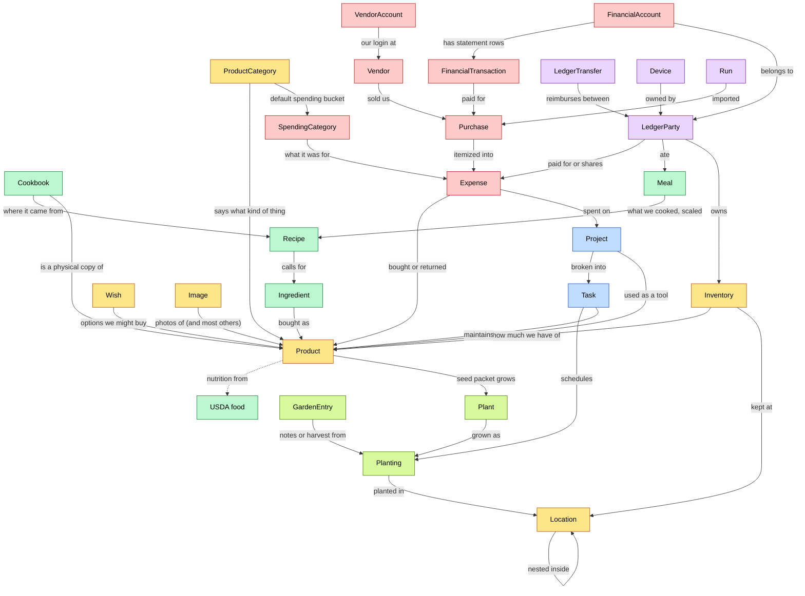

# 🥡 cubby

A household system for one home. It connects the pantry and recipes, meals and
nutrition, belongings and where they live, the garden, projects and upkeep, and
the money behind all of it.

[](https://deepwiki.com/nickysemenza/cubby)

Cubby is built for our household and nobody else. It is public on GitHub only
by accident. There are no sign-ups, no tenants, no billing, no social features
and no in-app buying. The native iOS/macOS app ships through internal
TestFlight, not the App Store. People use it in the web app, the native app, and
agent sessions over MCP.

## How we use it

- **What can I cook tonight, and what will it cost?** Recipes are joined to
  what we own and what it cost. The answer comes from stock plus staples marked
  "usually on hand".
- **Meal planning and logging.** Put recipes on the calendar, build a shopping
  list against stock, and log who ate what for per-person nutrition
  (`cubby-meal-logging`).
- **Where is X?** A location tree (house → room → shelf → bin) with printable
  QR labels, and barcode scanning and deliberate recount passes in the native app.
- **Orders and receipts.** Import retailer orders, receipt photos, order emails
  and statement CSVs, then reconcile purchases against card charges
  (`purchase-import`).
- **Belongings from photos.** Photograph a closet or a shelf, review the
  proposed products, then create inventory (`photo-inventory-import`,
  `product-enrichment`).
- **Garden.** Import a seasonal plan, track plantings by bed, and log harvests
  and notes with photos (`garden-plan-import`).
- **Projects and upkeep.** Renovations, yearly maintenance, tasks with
  dependencies, tool use, and what each project cost
  (`log-household-maintenance`).
- **Who paid for what.** A contribution ledger compares each member's
  spending, transfers and consumption.
- **Wishlist.** Things we want, each with candidate products and a price range.
- **Calendar.** Meals, task due dates, expenses and project spans in one
  planner, plus `webcal://` feeds for Apple Calendar.

### Tenets

These are standing decisions. A backlog idea that contradicts one is rejected,
not deferred.

1. **Inventory is a ballpark, not a ledger.** Nothing changes inventory as a
   side effect. Cooking a recipe, logging a meal, or importing an order never
   deducts or receives stock. Counts are corrected only by a deliberate
   [recount](docs/inventory-audit.md).
2. **`fdc_id` belongs to the Product, not the Ingredient.** A USDA link
   describes something you can buy. Ingredient nutrition always resolves
   through a product (`ingredient → product → fdc_id`).
3. **Rare, interactive work stays interactive.** Imports done a few times a
   year run with a human watching and get no queue, retries or dead-letter
   queue. The background queue is only for frequent, unattended or slow work.
   Derived data that is cheap to compute is computed at the source.
4. **One trusted household.** There is no multi-user coordination,
   restore/undo, reservations or locking. Any member may see household-wide
   data, including MCP analytics attribution. Speed and recoverability win over ceremony.
5. **All money lives on `Expense`.** Spend is always `SUM(Expense.cost)`.
   `Purchase.statedTotal` is a soft reconciliation cue, never summed and never
   a reason to reject a write. Card transactions are settlement evidence, not
   spend.

## Entities

Every entity has a public **shortcode** such as `PRD-4K7M`. It appears in URLs,
on QR labels and as the `id` over MCP. Shortcodes are case-insensitive and are
never reused. Printed `P-` and `L-` labels still resolve.

Everything hangs off **Product**. It covers groceries, clothes, tools,
appliances, books and seed packets alike. ProductCategory says what kind of
thing a Product is, and Inventory says where it is and how much. The other
areas (food, garden, work, money) attach to that core. Arrows say why each link
exists, and colors match the sections below: yellow things and places, green
food, lime garden, blue work, red money, purple people and system. The tables
give cardinality.


```mermaid
flowchart TB
  ProductCategory -- "says what kind of thing" --> Product
  Inventory -- "how much we have of" --> Product
  Inventory -- "kept at" --> Location
  Location -- "nested inside" --> Location
  Wish -- "options we might buy" --> Product
  Image -- "photos of (and most others)" --> Product
  Recipe -- "calls for" --> Ingredient
  Cookbook -- "where it came from" --> Recipe
  Meal -- "what we cooked, scaled" --> Recipe
  Plant -- "grown as" --> Planting
  GardenEntry -- "notes or harvest from" --> Planting
  Project -- "broken into" --> Task
  Vendor -- "sold us" --> Purchase
  VendorAccount -- "our login at" --> Vendor
  Purchase -- "itemized into" --> Expense
  SpendingCategory -- "what it was for" --> Expense
  FinancialAccount -- "has statement rows" --> FinancialTransaction
  FinancialTransaction -- "paid for" --> Purchase
  LedgerTransfer -- "reimburses between" --> LedgerParty
  Device -- "owned by" --> LedgerParty
  Ingredient -- "bought as" --> Product
  Product -. "nutrition from" .-> USDA[USDA food]
  Product -- "seed packet grows" --> Plant
  Cookbook -- "is a physical copy of" --> Product
  ProductCategory -- "default spending bucket" --> SpendingCategory
  Planting -- "planted in" --> Location
  Task -- "schedules" --> Planting
  Project -- "used as a tool" --> Product
  Task -- "maintains" --> Product
  Expense -- "bought or returned" --> Product
  Expense -- "spent on" --> Project
  LedgerParty -- "paid for or shares" --> Expense
  LedgerParty -- "ate" --> Meal
  LedgerParty -- "owns" --> Inventory
  FinancialAccount -- "belongs to" --> LedgerParty
  Run -- "imported" --> Purchase

  classDef core fill:#fde68a,stroke:#b45309,color:#000
  classDef food fill:#bbf7d0,stroke:#15803d,color:#000
  classDef garden fill:#d9f99d,stroke:#4d7c0f,color:#000
  classDef work fill:#bfdbfe,stroke:#1d4ed8,color:#000
  classDef money fill:#fecaca,stroke:#b91c1c,color:#000
  classDef people fill:#e9d5ff,stroke:#7e22ce,color:#000
  class Product,ProductCategory,Inventory,Location,Wish,Image core
  class Ingredient,Recipe,Cookbook,Meal,USDA food
  class Plant,Planting,GardenEntry garden
  class Project,Task work
  class Vendor,VendorAccount,Purchase,Expense,SpendingCategory,FinancialAccount,FinancialTransaction money
  class LedgerParty,LedgerTransfer,Device,Run people
```

### Things and places

| Entity                     | What it is                                                                                                                                                | Relates to                                                                                                                                                                                                                                                 | Typical use                                                        |
| -------------------------- | --------------------------------------------------------------------------------------------------------------------------------------------------------- | ---------------------------------------------------------------------------------------------------------------------------------------------------------------------------------------------------------------------------------------------------------- | ------------------------------------------------------------------ |
| **Product** `PRD-`         | Any one thing we can buy or own (a SKU), or a name-only `misc:` placeholder. Two copies share a Product; a different size or color is a different Product | N:1 ProductCategory, Ingredient; 1:N unit mappings (`1 cup = 120 g`, `1 bag = $4`); 1:N Inventory, Expense; kit parts. Referenced by Wish, `projectTool`, Task subject, Plant (seed packet), Location (a bought planter), Device, Cookbook (physical copy) | The shared core: stock, spend, recipes, nutrition, tools, wardrobe |
| **ProductCategory** `CAT-` | What kind of thing a Product is (Food › Baking, Books, Tools › Consumables), up to 3 levels deep                                                          | Tree; 1:N Product; N:1 SpendingCategory mapping                                                                                                                                                                                                            | Browsing, analytics, spending defaults                             |
| **Location** `LOC-`        | A place in the house or garden: Home → room → shelf → bin, bed, planter                                                                                   | Self tree (one Home root, an "Unknown" holding spot); 1:N Inventory, Planting, GardenEntry                                                                                                                                                                 | QR labels, arranging, "where is it?"                               |
| **Inventory** `INV-`       | How much of one Product is at one Location                                                                                                                | N:1 Product, N:1 Location (unique pair); optional owner LedgerParty                                                                                                                                                                                        | Stock estimate, valued on read through unit mappings               |
| **Image** `IMG-`           | A stored photo or document                                                                                                                                | N:M to almost every entity via attachments; sightings per member device                                                                                                                                                                                    | Product photos, receipts, invoices, garden photos                  |
| **Wish** `WSH-`            | Something we want but don't own yet                                                                                                                       | N:M Product candidates                                                                                                                                                                                                                                     | Price comparison before buying                                     |

### Food

| Entity                | What it is                                                                         | Relates to                                                                               | Typical use                                                   |
| --------------------- | ---------------------------------------------------------------------------------- | ---------------------------------------------------------------------------------------- | ------------------------------------------------------------- |
| **Ingredient** `ING-` | The brand-free recipe concept ("flour"), with aliases and a "usually on hand" flag | 1:N Product; 1:1 Recipe when it is a sub-recipe                                          | Recipe lines, staples, shopping                               |
| **Recipe** `RCP-`     | Something we cook                                                                  | 1:N sections → 1:N lines (ingredient + amount); N:1 Cookbook; forked from another Recipe | Scaling, cost and calorie totals, prep sheets, guided cooking |
| **Cookbook** `CKB-`   | The book an EPUB-imported recipe set came from                                     | 1:N Recipe; N:1 Product (the physical copy, human-confirmed)                             | EPUB import, recipe provenance                                |
| **Meal** `MEL-`       | One eating occasion on a day: cooked, eating out, takeout                          | N:M Recipe via MealRecipe (with scale); portions and direct food entries per LedgerParty | Planning calendar, shopping list, per-person nutrition        |
| **USDA food**         | A FoodData Central reference food, served by the `usda-api` Worker                 | Linked loosely from Product by `fdc_id` or barcode                                       | Nutrition facts                                               |

### Garden

| Entity                 | What it is                                                        | Relates to                                                                | Typical use                                       |
| ---------------------- | ----------------------------------------------------------------- | ------------------------------------------------------------------------- | ------------------------------------------------- |
| **Plant** `PLANT-`     | A cultivar or species, with our yes/maybe/no verdict              | 1:N Planting; 1:N seed-packet Product; N:1 Ingredient                     | What we grow and whether it's worth growing again |
| **Planting** `PLT-`    | One instance of a plant being grown: planned → growing → finished | N:1 Plant, Location, Task, seed Product                                   | Bed plans, sow and transplant dates               |
| **GardenEntry** `GDE-` | A dated note or harvest at a garden area                          | N:1 Location; N:M Planting; 1:N Image (the only home for planting photos) | Season log                                        |

### Work

| Entity             | What it is                                                        | Relates to                                                                                               | Typical use                               |
| ------------------ | ----------------------------------------------------------------- | -------------------------------------------------------------------------------------------------------- | ----------------------------------------- |
| **Project** `PRJ-` | A household undertaking: renovation, garden season, yearly upkeep | 1:N Task, Expense; parent Project; N:M blocked-by Project; N:M Product via `projectTool`                 | Planning, cost rollups, tool cost per use |
| **Task** `TSK-`    | A unit of work, with a trade                                      | N:1 Project (none means Inbox); subtasks; N:M blocked-by Task; N:1 subject Product (the item maintained) | To-dos, maintenance history               |

### Money

| Entity                          | What it is                                                          | Relates to                                                                        | Typical use                                                                                      |
| ------------------------------- | ------------------------------------------------------------------- | --------------------------------------------------------------------------------- | ------------------------------------------------------------------------------------------------ |
| **Vendor** `VEN-`               | Somewhere money goes (identity only)                                | 1:N Purchase, VendorAccount; default SpendingCategory                             | Vendor roster                                                                                    |
| **VendorAccount** `VACCT-`      | One member's account with a vendor                                  | N:1 Vendor                                                                        | Order-history and mail imports                                                                   |
| **Purchase** `PUR-`             | One order or receipt: order id, date, literal stated total, invoice | N:1 Vendor; 1:N Expense; N:M FinancialTransaction; N:1 Run that imported it       | Grouping lines from one checkout                                                                 |
| **Expense** `EXP-`              | A spend line, and **the only place money lives**                    | N:1 Purchase, Project, Product, SpendingCategory; attribution to LedgerParty      | Every spend total; `lineKind` covers principal, tax, shipping, discount, fee, tip and adjustment |
| **SpendingCategory** `SPC-`     | What money was spent on                                             | Tree; 1:N Expense, Purchase, FinancialTransaction                                 | Budget views, classification                                                                     |
| **FinancialAccount** `FAC-`     | A card or bank account                                              | 1:N FinancialTransaction; owner LedgerParty                                       | Statement import                                                                                 |
| **FinancialTransaction** `FTX-` | A charge, refund or payment from a statement, as evidence only      | N:1 FinancialAccount; N:M Purchase via allocations that sum exactly to its amount | Reconciliation: match / mismatch / pending                                                       |

### People and system

| Entity                    | What it is                                                                       | Relates to                                                                   | Typical use                                           |
| ------------------------- | -------------------------------------------------------------------------------- | ---------------------------------------------------------------------------- | ----------------------------------------------------- |
| **LedgerParty** `LPY-`    | A household member, guest or the household itself                                | Expense attribution, meal portions, owns Inventory, Device, FinancialAccount | Who paid, who ate, who owns it                        |
| **LedgerTransfer** `LTR-` | Value moving between parties, such as a reimbursement                            | From and to LedgerParty                                                      | Contribution positions (advisory only, never "debts") |
| **Device** `DEV-`         | One install of the native app                                                    | N:1 LedgerParty; N:1 hardware Product                                        | Photo-library sightings                               |
| **Run** `RUN-`            | A system-written background job: vendor sync, photo batch, mail search, AI calls | N:1 Vendor; predecessor Run; 1:N Purchase                                    | Import provenance and review                          |

Field-level vocabulary is in [docs/terminology.md](docs/terminology.md). The
full compiled relationship graph, including delete and merge behavior, is at
`/entities?tab=integrity` in the app.

## Example scenarios

These walkthroughs use made-up data.

1. **Weeknight chili.** A Meal on Tuesday gets one MealRecipe ("Chili", scale
   1.5). Two LedgerParties each get a portion in grams, and nutrition sums per
   person. The pantry Inventory does not change.
2. **Online order.** One order becomes a Purchase with three principal
   Expenses (each linked to a Product), plus a tax line and a shipping line.
   Later a card statement row becomes a FinancialTransaction, allocated in full
   to that Purchase. The reconciliation reads `match`.
3. **A return.** The refund is a negative Expense with `productQuantity` −1 on
   the original Purchase. The refund charge is allocated to the same Purchase.
4. **Closet photos.** A member uploads 20 photos to a `photo_inventory` Run.
   The agent pairs each shirt with its size-label photo and proposes Products.
   After approval, each becomes Inventory at "Closet shelf", owned by that
   member.
5. **Garden season.** A spring plan creates bed Locations, a "Garden 2027"
   Project, the Task "Sow tomatoes indoors", and a planned tomato Planting in
   bed A. The Planting is later edited to `growing`. A harvest GardenEntry with
   a photo is logged at bed A.
6. **Furnace filter.** "Changed the furnace filter" becomes a done Task in the
   yearly maintenance Project. Its subject Product is the furnace.
7. **Shared groceries.** One member pays for a grocery Purchase. Its Expenses
   are attributed to the household. A LedgerTransfer records the other member's
   reimbursement, and both positions update.
8. **Cookbook night.** An EPUB import creates a Cookbook and its Recipes. Each
   recipe line resolves to an Ingredient, and each Ingredient resolves to the
   Products we stock. Suggestions then lists the recipes we can make from stock
   and staples, with a cost.

## Working on it

TanStack Start + React on Cloudflare Workers, Drizzle + PostgreSQL (Neon via
Hyperdrive), R2, Rust → WASM for ingredient parsing and unit conversion, and a
SwiftUI app.

| Path                                                                                                                           | What                                                   |
| ------------------------------------------------------------------------------------------------------------------------------ | ------------------------------------------------------ |
| [apps/web](apps/web)                                                                                                           | The main app, HTTP API and MCP server (Worker `cubby`) |
| [apps/apple](apps/apple)                                                                                                       | Native iOS/macOS app, `CubbyKit`, `cubby` CLI          |
| [apps/usda-api](apps/usda-api)                                                                                                 | USDA lookup Worker                                     |
| [apps/mcp-apps](apps/mcp-apps)                                                                                                 | Interactive MCP UIs, inlined into `web`                |
| [packages/](packages), [recipebridge/](recipebridge), [recipebridge-cookbook/](recipebridge-cookbook), [cubby-ffi/](cubby-ffi) | Shared schemas, WASM and Swift FFI                     |

```sh
pnpm install
pnpm dev        # local workerd + PostgreSQL with synthetic data
pnpm check      # generate, types, lint, format, knip
pnpm test       # fast tests
```

**MCP.** On claude.ai, add a custom connector at
`https://cubby.nickysemenza.com/api/mcp`. In Claude Code or Codex, copy
`.mcp.json.example` to `.mcp.json`, then run
`claude mcp login cubby-localhost` or `codex mcp login cubby-localhost`. It uses
OAuth, so never add a static `Authorization` header.

Further docs:

- [AGENTS.md](AGENTS.md): agent rules and skill routing. Household workflows
  live in [.claude/skills/](.claude/skills).
- [docs/development.md](docs/development.md): architecture, commands, testing,
  deployment and the HTTP API.
- [docs/local-development.md](docs/local-development.md): the dev session.
- [docs/todos.md](docs/todos.md): the backlog.
- [docs/README.md](docs/README.md): everything else.
