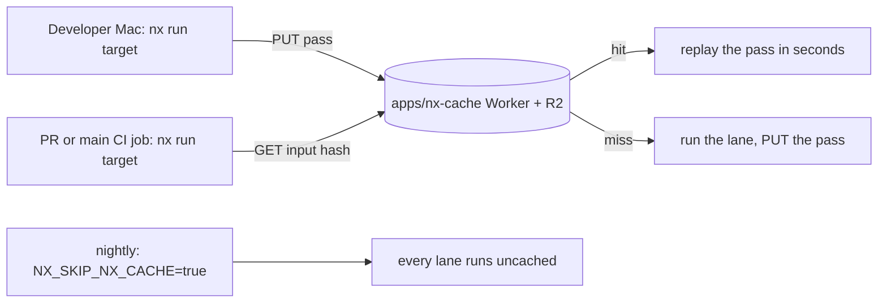

# Continuous integration

Every required check is an Nx target, and GitHub Actions runs each one on
every pull request and `main` push. A target's `inputs` decide its cache key;
a passing result for the same key in the shared Nx remote cache, whether CI or
the developer's Mac produced it, replays in seconds and satisfies the merge
gate ([ADR 0009](adr/0009-content-hash-merge-gate.md),
[validation policy](agents/validation.md)). Merging to `main` independently
deploys every production Worker, including after a documentation-only change;
deployment never waits for post-merge CI.

## Cache keys and the remote cache



The required test lanes key on the `gate` named input in `nx.json`: every
non-documentation file (the lockfile and `.github/` included), the Markdown
that the Worker bundles or generation reads (`docs/README.md`,
`docs/todos.md`, and the purchase-import, product-enrichment, and
photo-inventory-import skills). Platform, Node version, locale, and `CI`
stay out, so a developer Mac's pass counts for the Linux lanes. Web targets add
ignored `.env*` files, the WASM their `dependsOn` builds, the preview-build
switch, and the variables that select or reorder tests (`webGate` in
`apps/web/project.json`); the Rust targets add `rustc -V`, because
`rust-toolchain.toml` names a floating channel; the Apple targets add
`xcodebuild -version`. The nightly scheduled run sets `NX_SKIP_NX_CACHE` for
the whole workflow, so every lane, nested Nx calls included, runs uncached on
CI's platform, catching a failure that only Linux or CI's
toolchain shows; `main` pushes reuse the cache like PRs. The key is deliberately
broad. A false hit skips a check that should have run, so a target that starts
reading something new must have it in its inputs. A change to ordinary
documentation, a rebase that leaves the content unchanged, or a re-push of a
tested tree hits; any code change misses.

Known gaps the nightly run covers rather than the key: the Worker bundles all
of `docs/**/*.md`, but only the Markdown listed above is in the web keys, so a
documentation-only change replays the browser and workerd lanes; and the Apple
key omits the Rust toolchain and FFI build settings, so a changed compiler
reuses an earlier Apple pass.

To let CI replay a local pass, run the lane exactly as its CI job does from a
worktree without ignored `.env*` files, for example
`CUBBY_E2E_SHARD=2/4 pnpm exec nx run @cubby/web:e2e` for each of the four
browser shards, `CUBBY_POSTGRES_SHARD=1/2` and `2/2` for `@cubby/web:postgres`,
and `pnpm apple check` for the Apple lanes. An unsharded run is a different key.

Nx's built-in HTTP remote cache (`apps/nx-cache`, a Worker over R2) is the
shared store. Nx connects when `NX_SELF_HOSTED_REMOTE_CACHE_SERVER` and
`NX_SELF_HOSTED_REMOTE_CACHE_ACCESS_TOKEN` are set: the developer's Mac sets
them in its shell, and in CI `setup-node-with-deps` exports them from the
`NX_CACHE_URL` and `NX_CACHE_TOKEN` repository secrets. A fork PR receives no
secrets, so both stay unset and its jobs use only the runner's empty local cache:
every lane runs, and nothing is written to the shared cache. Nx never caches a
failed task.

Nx fails a task on any remote-cache error other than a 404 miss, so
`setup-node-with-deps` first requests a missing entry and connects only on a
404; when the Worker is down or the token is rejected, the job warns and runs
its lanes uncached. The bucket expires entries after 30 days (an R2 lifecycle
rule on `cubby-nx-cache`). To rotate the token, run `wrangler secret put
CACHE_TOKEN` in `apps/nx-cache`, then update the `NX_CACHE_TOKEN` repository
secret and the Mac's `NX_SELF_HOSTED_REMOTE_CACHE_ACCESS_TOKEN`; jobs started
in between run uncached.

Project relationships (`implicitDependencies` and `dependsOn`) decide which
prerequisite targets run and in what order (WASM before its consumers, the MCP
App bundle before the web fast tests). Nx-inferred affected projects
(`nx show projects --affected`) remain a local convenience, not CI scoping.

## Local verification

`pnpm verify:local` is an optional local diagnostic; commands and when to use
it live in the [validation policy](agents/validation.md) and
[quality guide](agents/validation-quality.md). Facts that shape it:

- `--parallel=1` is deliberate: every tier is already parallel inside (vitest
  workers, Playwright workers, cargo, xcodebuild), and running tiers side by
  side on one host reproduces the contention the sequential `test:all` removed
  — measured 2026-09-16, the web unit tier took 196s instead of 24s under
  `run-many`'s default parallelism and tripped a 5s test timeout.
- Selected targets replay from the Nx cache when their content is unchanged.
  The browser and workerd targets build the Worker inside their own command
  (`build-cf.ts --ensure`) rather than through `dependsOn`, because the
  `build-cf` key includes the Git commit for provenance and would rebuild before
  every replay.
- The textual order of the `run-many -t` list is not an execution-order
  contract; Nx dependencies provide the ordering (WASM before its consumers,
  web build before E2E). `verify:local:full` sets `NX_SKIP_NX_CACHE=true` so
  every target executes.

Commit hooks, push behavior, and the merge gate are defined in the
[validation policy](agents/validation.md).

Node 24, pnpm 12.7.0, Rust/wasm-pack, Apple `container` on macOS (external PostgreSQL/IntegreSQL on Linux) and Playwright
browsers must be available; [test tiers](agents/validation-tests.md) cover database setup.
PostgreSQL remains the authoritative integration tier; Playwright defaults to
one worker on hosted runners and two on local macOS in `playwright.config.ts`,
the `e2e` target passes `--workers=2` for each shard. Both tiers reject an empty selection or an
unexpected skipped test without freezing the suite to a hand-maintained count;
a Vitest `-t` run accepts tests the pattern left out but still fails when the
pattern matches nothing or a matched test is skipped.
Browser verification always follows the current web build: the `e2e` target
runs `build-cf.ts --ensure` first.

These cache and dependency changes reduce duplicate work and stale generated
artifacts, but do not promise that two simultaneous full verifications are
resource-safe on the same machine. Keep heavy local runs coordinated when the
host is constrained.

`pnpm apple check` runs `nx run apple:check`, which depends on the two
halves CI runs on separate runners (`apps/apple/project.json`, backed by
`scripts/apple-check.sh`). `apple:host-tests` runs CubbyKit's package tests on
the macOS host and the OpenAPI generator-warning gate; `apple:simulator-build`
runs the `@State`/`@StateObject` grep, `swift format lint`, and a
generic-simulator `xcodebuild build` of `Cubby-iOS`, and caches the built
`Cubby.app` as its output. Both use one build profile on every machine (native
arm64 slice, batch mode, no signing or index store, package clones in
`apps/apple/SourcePackages`), so a Mac's result means what CI's does.
`apps/apple/scripts/prepare-project.sh` first runs `node
scripts/ensure-apple-ffi.ts` (the Nx-cached xcframework and UniFFI shim),
`scripts/generator/ensure.ts` (the generated Swift and the OpenAPI inputs of
the `CubbyAPI` build plugin; none is committed), and, except for host tests,
`xcodegen generate --use-cache`. The script skips itself (with a message, not a
failure) when `xcode-select -p` fails; that skip is keyed on the missing Xcode
and never matches a real result. The `rust` target runs fmt/clippy/test per
crate (`recipebridge/project.json`, `cubby-ffi/project.json`).

`cubby-ffi` and the WASM packages share the `recipebridge` Rust core and Cargo
lockfile, but each target needs its own compiled artifacts. EPUB extraction is
the separate wasm-only `recipebridge/cookbook` crate, and `cubby-ffi` turns off
`recipebridge`'s Worker-only default features (`html`, `ai-usage`), so Apple
targets compile neither the cookbook crate nor `page.rs`. The `rust` target
also lints `recipebridge --no-default-features`, the browser build.
The unused local Rust model-pricing export is removed; Cubby usage pricing
reads `models.dev` in TypeScript. Cookbook's upstream pricing table remains
transitive until the [pricing consolidation](todos.md#ai--search) is completed.

`apps/apple/project.yml`'s `Cubby-iOS` scheme also lists CubbyKit's own tests
as a local package test target (`package: CubbyKit/CubbyKitTests`), so
`xcodebuild test -scheme Cubby-iOS` on a simulator runs both `Cubby-iOS-Tests`
and CubbyKit's package tests together — useful locally, but hosted CI does not
use it (see below). `apps/apple/CubbyKit/Tests/CubbyKitTests/VisionHardware.swift`
defines a `.requiresVisionHardware` trait that skips Vision-dependent
contracts (`SubjectLift`, `FeaturePrintIndex`) when running on the Simulator,
for whichever caller — local or hosted — ends up running that scheme there.

Two hosted macOS jobs, `Apple host tests` and `Apple simulator build`, run in
parallel on every PR and `main` push. Each installs the workspace (which also
generates the Swift inputs) and, outside the nightly run, first runs its Nx target with
`CUBBY_NX_CACHE_PROBE=1`: Nx replays a cached pass for the same input hash,
and on a miss the script fails before building (Nx never caches that failure).
Only a miss pays for the FFI, XcodeGen, and Xcode build caches and the real
run. The nightly run skips the probe and runs both with `--skip-nx-cache`. The Apple key leaves out the Rust compiler: CI hashes before its Rust
setup, and the probe and the run must agree on the key. Each job first selects the
Xcode in `apps/apple/.xcode-version` when the image has it, so a Mac result
with that Xcode satisfies CI; bump the file when the Mac's Xcode changes.
The host job runs the automatically generated
`CubbyKit-Package` scheme with `xcodebuild test` on the ARM macOS host — no
simulator. The aggregate package scheme includes all CubbyKit tests and the CLI
product; the library-only `CubbyKit` scheme has no test action. The command uses
`-onlyUsePackageVersionsFromResolvedFile` to keep the committed package pins.
Its `xcode-host-v1` cache stores `apps/apple/CubbyKit/.build`, including the
Xcode compilation cache and dependency checkouts under `.build/xcode` and the
SwiftPM warning-generator products. Xcode's `Build` and `Logs` directories are
excluded: tests rebuild products from cached compiler results rather than
restoring timestamp-sensitive objects and test bundles. Keys include the Xcode
toolchain, package pins, CubbyKit sources, and warning-check script. It then
runs `apps/apple/scripts/check-openapi-warnings.sh`, which fails on any
swift-openapi-generator warning (a schema the `CubbyAPI` build plugin would
silently drop). A successful warning check records its content key inside
the cached `.build` directory; unchanged document, config, generator pin,
toolchain, and check script reuse that pass without rebuilding or regenerating.
Changed inputs run the full check, and warnings or generator failures never
record a pass. The simulator job restores its simulator-only FFI framework and
runs the generic-simulator build with no tests or simulator boot. The
lightweight `Apple checks` job preserves the required status context and
succeeds only when both macOS jobs succeed; failures, cancellations, or
unexpected skips fail that gate. Aggregate checks use `!cancelled()` so
whole-workflow cancellation can stop them while ordinary failed dependencies
still reach their result checks.

Each SDK keeps its own compilation cache. Parallel jobs use two macOS
runner slots to avoid adding the host and simulator compile times after a
cache miss or source change. A generated-schema change still recompiles the
client for each SDK; neither cache reuse nor a five-minute ceiling is guaranteed.
The generated `CubbyAPI` target forwards `-gline-tables-only` directly to the
Swift frontend, so the driver's default `-g` does not restore full debug type
information. Handwritten Swift targets retain their normal debug information.

The Xcode project and host package-test command enable Apple's compilation cache
and its hit/miss remarks. Content-addressed results live in
`DerivedData/CompilationCache.noindex` for the simulator and
`CubbyKit/.build/xcode/CompilationCache.noindex` for the host, inside their
successful-build caches. This can replay compiler work when
ordinary build products need rebuilding but the compiler inputs are unchanged;
new source inputs still compile. Local `swift test` remains available and does
not use this Xcode cache.

A local ARM/Xcode 27 experiment on 2026-10-06 changed every native input's
mtime without changing its contents, then removed the Xcode build products.
The host's CAS-and-clones-only replay passed the same 661 tests in 37s
(386/386 compiler-cache hits), versus 130s cold. The simulator build replay
passed in 32s (227/227 hits), versus 161s cold. These demonstrate reuse without
the deleted timestamp helper or XCBuild inode override; they do not establish
hosted Xcode 26 job times or include GitHub cache transfer and runner queueing.
Manual native E2E installation (`apps/web/tooling/sim-e2e.ts`) runs
`apple:simulator-build`, so an unchanged app is restored from the Nx cache.
Removing a shared build helper requires checking those manual callers as well
as the required workflow.

The earlier simulator-test job ran `xcodebuild test` on a concrete simulator:
first boot cost about 6 minutes plus roughly 10 minutes of CPU starvation
(a 5s script took 2.6 minutes, and compilation doubled). Host tests and the
generic-simulator app build keep that simulator work excluded.
`.github/actions/setup-apple-tools` installs XcodeGen and restores
`apps/apple/SourcePackages`, the `xcodebuild`-resolved SPM clones for Sentry,
GRDB, Nuke and swift-openapi-generator (previously an uncached "Resolve Package
Graph" on every run), used by `Apple simulator build`. It is separate from the
target-specific FFI output cache (`.github/actions/setup-apple-ffi`) and the
host job's build cache described above. DerivedData keys explicitly exclude
the host `.build` directory; its compiled products are not simulator source
inputs. Host and simulator caches have separate Xcode toolchain and package
graph keys. Dependency declarations live in XcodeGen’s included
`apps/apple/packages.yml`; app versions and build settings stay in the product
key, so a version bump does not discard dependency precompiled modules. A
package declaration, local Swift package graph, or resolved-pin change still
invalidates those modules. App pins live in `apps/apple/Package.resolved`;
Kit pins remain in `apps/apple/CubbyKit/Package.resolved`. Simulator dependency
cache keys include both lockfiles and both specs.

Compiled Apple caches are published only after successful work. GitHub cache
entries are immutable: saving an interrupted compile under the final content
key makes every exact hit repeat that unfinished work, and a successful build
cannot repair the entry. Simulator DerivedData `v6` excludes earlier entries
that could have been saved after cancellation or failure. Host `xcode-host-v1`
starts separately from the retired standalone SwiftPM `v2` cache. A new generation pays one cold build; unchanged successful restores
are the evidence for warm performance. Dependency clones remain advisory.
With the previous timestamp-normalizing backend, a controlled same-head [cold build and warm rerun](https://github.com/nickysemenza/cubby/actions/runs/37418543352)
on 2026-10-05 took 7:39 and 4:35 respectively in the Apple app job after the
successful exact-key DerivedData restore. Swift compilation log entries fell
from 1,380 to two. This verifies reuse for unchanged inputs; one controlled
rerun does not establish a PR median.
After the main cache was seeded, a [normal main Apple app job](https://github.com/nickysemenza/cubby/actions/runs/37423177521/job/112138086525)
on 2026-10-05 restored the same exact 419 MB DerivedData entry and passed in
3:47, with two Swift compilation log entries for generated asset symbols.
This confirms cross-run main-cache reuse, not a new required-check median.
A controlled [same-head SwiftPM cold build and warm rerun](https://github.com/nickysemenza/cubby/actions/runs/37423177521)
passed the same 646 tests in both attempts: the package job fell from 8:03 to
2:57 after restoring its exact main cache, and compilation fell from 357s to
72s. Cache restore and generator-warning checks still contribute to the warm
job. This controlled measurement does not establish a PR median.
Retire obsolete cache generations and merged PRs' private cache entries with
GitHub's cache controls after main is seeded; retain active PR and current main
entries. The repository keeps the default 10 GB cache limit, so no paid cache
capacity or custom cleanup scheduler is needed.

## Hosted suite

The `CI` workflow runs automatically for pull requests to `main` and pushes to
`main`. Superseded PR runs are canceled. Main runs finish rather than being
canceled by later merges, so native checks can publish reusable caches.
GitHub concurrency keeps
one main run active and at most one pending; a newer push replaces the pending
run. This does not add parallel main runs or jobs. The newest main CI result may
wait for the active run; deployment remains independent. `Scope` keeps its
stable required name and rejects live entity codes in PR text; no lane waits
for it. `Validation` runs `pnpm check:all` (the cached generate, types, lint,
format, knip, bindings, script, and Worker-test targets plus the uncached
security audit), `pnpm dedupe:check`, and the offline relative-link check through
the pinned Lychee action. Paths written as inline code are informational; link a
repository file when its existence should be checked. Generated output is never
committed; every job that installs dependencies generates it (`postinstall`), and
`Validation`'s `generate` gate checks that it generates cleanly and that the OpenAPI
document lints.

`Web checks` is the stable required aggregate over the Worker runtime,
fast-test, PostgreSQL, and browser jobs. Its shell-only status check uses the
standard `ubuntu-slim` container runner; it needs no checkout, dependencies,
services, or privileged operations. Queue and startup time remain part of
measured gate latency.
`Auxiliary tests and builds` runs `nx run-many -t test`: every auxiliary
package's tests and the `unit`, `mcp-contract`, `worker-safety`, and `ui`
Vitest projects of the web app, each a cached target. Node projects run first,
then UI uses Vitest's standard project group ordering, keeping each phase's
worker environment together. `Build Workers and runtime tests` runs the
`db-check` migration drift check against disposable scratch databases and the
`integration-workerd` Vitest project against a Worker it builds itself.
Desktop Chromium runs as four Playwright shards (two workers each) through the
`e2e` target, each building the Worker with the run's source commit and branch
provenance. Phone-web and WebKit browser coverage was removed from PR CI and the
Playwright suite; native checks remain separate. There is no coverage mode.
The disposable PostgreSQL container uses `fsync=off`, `synchronous_commit=off`,
and `full_page_writes=off`, matching the local test-service settings. These
[standard non-durable settings](https://www.postgresql.org/docs/17/non-durability.html)
remove disk durability work from synthetic test data; CI does not test database-server
crash recovery. SQL constraints, transactions, and the full reset still run.

Desktop CI passes Playwright's `--trace=off`: recording every test for
`retain-on-failure` adds work, and raw traces are excluded from hosted artifacts.
Local runs retain failure traces; CI preserves failure annotations, sanitized
case results, provenance, checksums, and structured Worker diagnostics.
For a local debugging replay, replace the manifest's `--trace=off` argument
with `--trace=retain-on-failure`.
Browser shards save sanitized case results, a run manifest, and SHA-256
checksums on success and failure for seven days; a replayed pass restores the
bundle of the run that produced it. The manifest records the tested
commit, build fingerprint, and replay arguments; a dirty local run or unmatched
build is marked as not exactly replayable. The manually dispatched native
simulator E2E saves the same bundle format with its app build fingerprint and
runtime. Raw reports, traces, screenshots, and logs stay local because they may
contain household data or credentials.
`E2E tests (purchase import agent, optional)` runs the Playwright project of
that name (`purchase-import-run.spec.ts`: the purchase agent with a scripted
model and gateway, driven through the browser) through the
`e2e-purchase-import` target, building its own Worker. It is informative only:
it is not in `Web checks` or the ruleset. Its key is narrow on purpose (the
agent, purchase import, the Run, Purchase and vendor order-mail UI, its harness,
and the bundled skills), so an unrelated change replays its last result. It
saves the same run bundle as the desktop shards.
The `integration` Vitest project runs as two `postgres` target shards
(`CUBBY_POSTGRES_SHARD`, Vitest `--shard`), each with four fork workers. The
`integration-workerd` project (the files that start the built Worker, listed in
`workerdIntegrationTests` in `apps/web/vitest.config.ts`) runs in `Build
Workers and runtime tests`. A workerd consumer missing from that list runs in
an ordinary integration shard and fails there, because in CI the harness
refuses to rebuild a missing or stale Worker. Jobs that need the databases
declare native GitHub Actions service containers; YAML anchors reuse the
pgvector PostgreSQL and pinned IntegreSQL definitions. GitHub owns the network, container
startup, PostgreSQL health wait, logs, and cleanup. PostgreSQL also maps port
55432 for guarded named-database tests. `POSTGRES_INITDB_ARGS` sets the disposable
settings in the fresh PostgreSQL 17 configuration. IntegreSQL retries its
PostgreSQL connection during startup; its pinned distroless image has no
`/bin/sh` for Docker shell health checks. The optional purchase-import and
Tester Army Linux lanes use the same service definitions.The
`@claude` mention workflow (`claude.yml`) remains manual;
`claude-code-review.yml` reviews each non-Renovate, non-fork PR once,
on `opened`/`ready_for_review`/`reopened` (never on `synchronize`, so a push
does not trigger a re-review), using Sonnet 5. Preview deploys were removed;
production is the only deployed environment.

## Apple TestFlight release

Normal merges to `main` wait for the nightly check at 10:17 UTC. It publishes
current `main` when files that can reach the app changed since the last complete
upload (the workflow's inline `full`/`apple` path filters),
or that upload is at least 30 days old. A changed
`APPLE_CLIENT_COMPATIBILITY_VERSION` in `packages/shared/src/apple-client-version.ts`
publishes promptly; comment-only edits do not. The shared value supplies both
the generated `MARKETING_VERSION` and server minimum. Bump it for wire-breaking
changes; compatible changes need only a new CI build number.

For an immediate build or retry, dispatch a fresh run:

```sh
gh workflow run apple-testflight.yaml --ref main
```

Publishing uses one pinned current-main commit, increasing build numbers, and
one active workflow. Reruns are refused, including checkpoint-only retries.
Each platform archives, verifies, and uploads on its own macOS runner. Only
both uploads succeeding writes the `apple-testflight-uploaded` checkpoint;
no-op and partial releases do not advance it. Missing or expired checkpoints
rebuild. A partial failure's next fresh run rebuilds both platforms.

Uploads are internal-only with automatic group distribution. Verify processing
and installation in TestFlight after publishing: upload acceptance alone does
not establish availability. Server deployment remains immediate, so breaking
changes can leave an update-required period until the new app is installed.

After a long pause, manually re-enable scheduling and dispatch a fresh build.
GitHub can disable public-repository schedules after 60 inactive days; the
30-day refresh does not prevent this.

## Deployment

`.github/workflows/deploy.yaml` runs on `main` pushes and deploys all four
production Workers every time. The purchase-agent deploy waits for the web
Worker, while the auxiliary Workers run
independently. Each Worker serializes production deployments and checks that
the commit is still current main before building and again before deploying.
Production never depends on a test job.
This trusts required PR checks before merging. Public-repository standard
GitHub-hosted runners are free; no self-hosted runner or Cloudflare Builds is
required.

All three jobs call the shared `.github/actions/deploy-worker` composite
(`check-current-main` → `setup-node-with-deps` → an optional build command →
`check-current-main` again → the deploy command), differing only in package,
workspace filter, whether WASM is needed, and the build/deploy commands;
`concurrency`, `environment`, and `timeout-minutes` stay on each job because
a composite action cannot own them. Every deploy is a plain shell command
with `CLOUDFLARE_API_TOKEN`/`CLOUDFLARE_ACCOUNT_ID` in the environment: the
auxiliary Workers and purchase-agent run their package's own `deploy`
script, and web runs `wrangler deploy --config dist/server/wrangler.json`
directly rather than its `deploy:cf` script (`build:cf && wrangler deploy`),
which would rerun `build:cf` a second time after the composite's own build
step already ran it. The second `check-current-main` is what stops a manual
re-run of an old Deploy run from rolling production back to a stale commit.

## Branch protection and measurement

The `main` ruleset requires `Scope`, `Validation`, `Web checks`, auxiliary,
Rust, and Apple checks. Every lane runs on every PR; the aggregates verify
their matrix and macOS jobs. Keep `strict` disabled so
a green non-conflicting branch need not rebase, allow administrator bypasses,
and do not require human review.

Record ten public PR runs before changing topology: queue time,
required-check p50/p95, per-lane duration, cache behavior, cancellations, and
merge-to-deploy duration. The target is a 4–7 minute warm critical path and no
more than 10 minutes cold. Optimize only a measured bottleneck; prior evidence
already rejects node_modules caching. Track queue and
cold native builds separately; the target is not a measured runtime guarantee.

### Measured decisions

Keep the full experiment tables in Git history; this page records the decisions
that still shape the current checks. When changing CI topology, collect at least
five naturally occurring successful PR runs before claiming a new
median, and compare queue time, required-check p50/p95, cache misses,
cancellations, job-minutes, and merge-to-deploy time. Do not infer a speedup
from a single warm run or a different host load.

Before the PostgreSQL/runtime split, ten successful PR runs sampled on
2026-10-05 had a slowest desktop E2E job of 7:35–8:44, with job-ready-to-start
waits no longer than 57 seconds. Representative
[web](https://github.com/nickysemenza/cubby/actions/runs/37407377916) and
[cross-client](https://github.com/nickysemenza/cubby/actions/runs/37406566591)
runs show that browser execution and native compilation remain the full-PR
bottlenecks. The split removes an unnecessary prerequisite for ordinary
database contracts; it does not establish a five-minute full suite.

- Desktop Chromium uses four shards and ordinary PostgreSQL files two, since
  the remote cache made a run's cost proportional to its changed content
  ([ADR 0009](adr/0009-content-hash-merge-gate.md)); hosted timings for that
  split are not yet measured. Earlier, more workers per runner and three
  shards did not improve the critical path enough to justify their setup and
  contention costs.
  A three-worker re-benchmark on the larger suite passed all 160 cases, but a
  same-head replay of its slower 80-case shard reduced Playwright execution
  only from 391 to 375 seconds while cumulative case time rose from 665 to
  911 seconds and navigation time from 270 to 377 seconds. Keep two workers
  per runner: the repeated latency increase did not justify the small,
  variable critical-path benefit. The
  [bounded trial](https://github.com/nickysemenza/cubby/actions/runs/37499250416)
  and [two-worker baseline](https://github.com/nickysemenza/cubby/actions/runs/37497540250)
  do not establish a new median or isolate runner variability.
  Phone and WebKit browser projects were removed
  from PR CI; device-dependent phone behavior still needs device acceptance.
- The fast projects share one job to reduce runner demand. Ten completed PR
  runs sampled on 2026-10-06 (six successful, four failed) had Node jobs of
  1:47–2:06 and UI jobs of 1:21–1:43, while the slowest desktop shard took
  7:51–8:58. Representative
  [successful](https://github.com/nickysemenza/cubby/actions/runs/37426186409)
  and [failed](https://github.com/nickysemenza/cubby/actions/runs/37426021174)
  runs support testing that consolidation outside the browser critical path;
  they do not establish the combined job's hosted runtime or a new PR median.
- Test page loads spend much of their time waiting for hydration and queued
  JavaScript chunks under the harness's HTTP/1.1 connection limit. A measured
  HTTPS/HTTP/2 proxy added runner time without a useful end-to-end gain.
  Preloading the recipebridge WASM also did not improve hydration.
- Caching `node_modules` was slower than installing from the warm pnpm store.
  Saving the pnpm store from Playwright containers likewise cost more than the
  filtered install. Retain exact-key caches for generated artifacts and Apple
  dependencies where the measured build work exceeds restore cost.
- Local full verification runs Nx targets sequentially because the individual
  test/build tiers are parallel internally. The parallel `run-many` trial took
  10:54 and failed under contention; the sequential trial took 6:49 and passed
  on the same shared host. These are observations, not runtime guarantees.
- Keep pure grouping and projection tests in the fast tier, transaction and
  SQL behavior in PostgreSQL, and browser-only contracts in Playwright.
  Previously consolidated test files and changed worker counts are not reasons
  to move a behavior to a more expensive tier.

## Operational checks

Before changing CI, run:

```sh
actionlint -no-color .github/workflows/*.yaml
pnpm run check
pnpm exec nx show projects --affected --base=origin/main
```

After a material workflow change, compare at least ten representative runs for
PR p50/p95 wall time, merge-to-deploy time, total job-minutes, cancellations,
and cache behavior.
