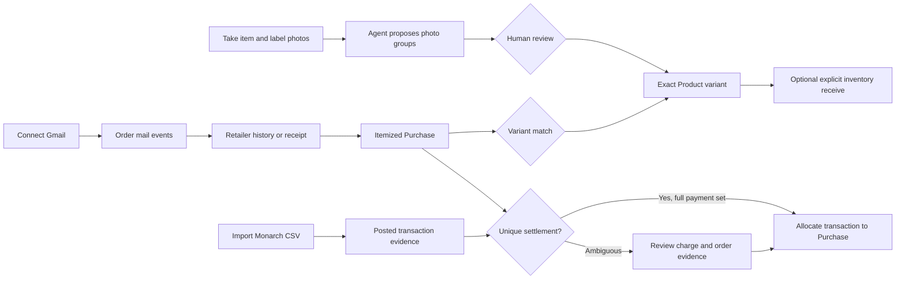
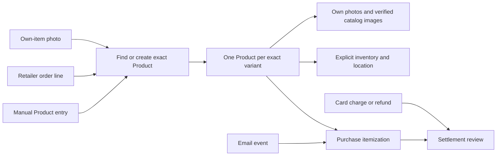
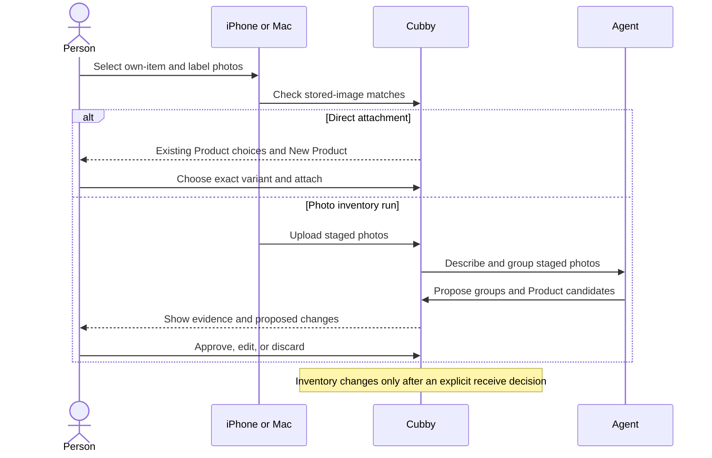

# One product, however its evidence arrives

A Product is Cubby's record for one exact item variant. A black small shirt and
a navy small shirt are different Products. Two physical copies of the same
black small shirt share one Product; their inventory quantity records the
copies. A Product can exist before Cubby knows its purchase, before it has a
photo, or before anyone decides where it is kept.

The goal is simple: starting from a photo, a retailer order, an email, a card
transaction, or a manual entry, a person can reach **one well-identified
Product** with the right evidence attached. The entry point and sequence do
not change what the result means.

## The whole journey

Connect read-only Gmail in Cubby Settings, import a Monarch CSV through the
MCP statement preview, and capture own-item and label photos on iPhone or Mac.
These sources can arrive in any order. Cubby should converge them on one exact
Product, an itemized Purchase, and a truthful settlement allocation. A human
reviews uncertain identity, grouped photos, and ambiguous charges. Flue can
coordinate the browser, mail, and photo jobs; Jev can help rank bounded
ambiguous choices. Neither agent substitutes for source evidence or approval.

The statement does not identify an item, and a photo does not prove where it
was bought. A delivered email and a card charge do not receive inventory.

### What works today and what still needs work

| Part        | Current path                                                                                                                           | Next product step                                                                                    |
| ----------- | -------------------------------------------------------------------------------------------------------------------------------------- | ---------------------------------------------------------------------------------------------------- |
| Gmail       | Google connection in Settings grants read-only Gmail; order mail can feed discovery.                                                   | Make source coverage and missing itemization obvious in one journey view.                            |
| Monarch CSV | An MCP client parses locally, previews normalized rows, then writes approved transactions.                                             | Add a first-class CSV upload/review screen and match late-arriving statements to existing Purchases. |
| Photos      | Native upload creates a photo run; Flue proposes groups; web review approves them. Direct native Product photo attachment also exists. | Bring run status, group review, and Product match evidence into the native app.                      |
| Settlement  | Purchase import can allocate a unique complete payment set to a transaction already recorded.                                          | Give ambiguous and reverse-arrival matches a single review worklist.                                 |
| Activity    | Flue conversation streams; the run record and system log refresh while active.                                                         | Show one coherent event timeline and stage durations on desktop and phone.                           |

The [shared photo skill](../.claude/skills/photo-inventory-import/SKILL.md)
and [purchase skill](../.claude/skills/purchase-import/SKILL.md) apply to
Flue, Codex, and Claude. They encode source boundaries and review rules, not
one model's private prompt.

## What a successful journey looks like

1. **Identify the item.** Compare brand, model, distinguishing features,
   color, size, and any exact identifier. A label's letter must be interpreted
   in context: a fit mark can be separate from the boxed size. An unreadable
   field stays unknown; it does not become a guess. Exact variants take
   priority over a Product merely because it has fewer photos.
2. **Find an existing Product before creating one.** Search identifiers and
   aliases as well as names. A purchase-created Product with no own photo is a
   good candidate for a later photo. A photo-created Product without a
   purchase is a candidate for a later order. A vendor-imported image does not
   mean the item has already been photographed at home.
3. **Keep provenance visible.** Own photos, labels, retailer catalog images,
   order lines, mail events, and statement transactions are different kinds of
   evidence. A matching amount and date are a settlement candidate, not item
   identity. A generic email subject is an event clue, not an itemized order.
4. **Review ambiguous identity.** An exact external identifier may connect a
   new order line to an existing Product. A descriptive match is proposed for
   review. If two variants remain plausible, show both and the distinguishing
   evidence. If duplicate Products already exist, the merge preview shows
   which scalar values survive, which values are filled, and which images and
   relationships combine before the person confirms.
5. **Record ownership deliberately.** A photo group can attach to a Product
   without an inventory entry when owner or location is unknown. An order can
   be imported without receiving inventory. Neither a delivered email nor a
   charge changes inventory on its own. Returns and refunds update purchase
   and settlement evidence; they do not silently remove a household item.

## Entry points

| Start                       | Short path to the Product                                                                                                     | Human decision                                                       |
| --------------------------- | ----------------------------------------------------------------------------------------------------------------------------- | -------------------------------------------------------------------- |
| iPhone or Mac photo, no run | Check for the same stored image, choose an existing Product or create the exact variant, then attach the photo with its role. | Confirm the Product and, separately, whether to add inventory.       |
| Photo inventory run         | Upload photos; the agent proposes item and label groups and existing Product matches; review each group.                      | Approve, edit, or discard groups before Product or inventory writes. |
| Retailer history or receipt | Capture stable order identity and exact itemized lines; resolve each line to a Product or a reviewable candidate.             | Resolve uncertain variants and any purchase findings.                |
| Gmail order event           | Find order events by sender, order id, and time window; use the retailer detail for itemization.                              | Review incomplete or conflicting lifecycle evidence.                 |
| Card or export transaction  | Match a real posted charge or refund to its order or orders.                                                                  | Confirm ambiguous allocations; never invent a balancing transaction. |
| Manual Product creation     | Search existing Products, create the variant, then add photos, purchase, or inventory later.                                  | Confirm identity and optional inventory.                             |

## Evidence traps from a synthetic wardrobe case

The [regression corpus](../apps/web/tests/fixtures/product-identity-evidence.ts)
uses the fictional **ForgeWear** black small pocket tee.
Its own label has a fit mark and a separate boxed size. The catalog also has
navy small, white small, and black medium variants. A saved retailer page is
duplicated, an earlier trial order lists the same item, and the trial's final
email lists that item among the returns while charging for other retained
items. A later two-item order has an email subject without the brand, and
overlapping card exports repeat a combined charge. Another nearby charge has
the same amount. An order-page listing or trial charge alone cannot establish
that the photographed item was purchased in the trial.

The expected result: black small ranks above the other variants even if it
already has an own photo; the reviewer can attach the new photo to that
Product; the duplicate page creates no duplicate Purchase; the trial order
does not establish ownership for a returned trial item; repeated statement
rows create no duplicate transaction; and settlement remains unresolved until
the specific charge and order relationship is supported. This scenario is
fictionalized from local evidence. Raw exports and saved pages stay outside
the repository.

## How to check the journey

Use synthetic fixtures for the complete path: manual creation or exact match,
photo grouping and approval, order preparation and replay, ambiguous
settlement, and a return or trial that does not imply ownership. On iPhone,
repeat the direct photo and new Product paths in a disposable local database;
inspect the candidate order, taps, review language, and final Product detail.
On web, verify the same Product, attached image roles, purchase line, and
settlement status. Record a simulator or browser video when interaction quality
is the question. Keep real household evidence in local analysis only.
