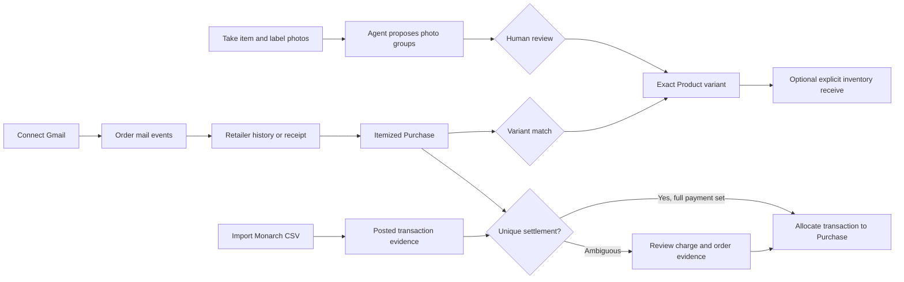
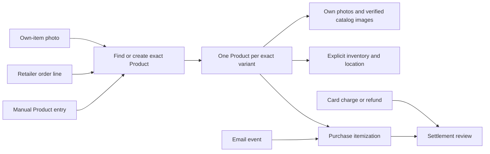
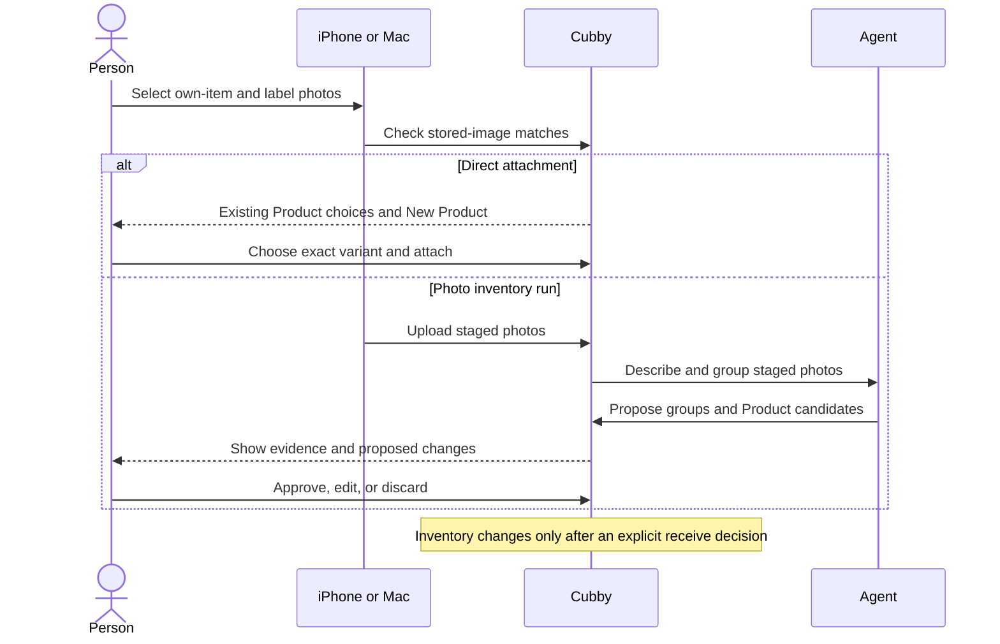

# One product, however its evidence arrives

A Product is Cubby's record for one exact item variant. A black small shirt and
a navy small shirt are different Products. Two physical copies of the same
black small shirt share one Product; their inventory quantity records the
copies. A Product can exist before Cubby knows its purchase, before it has a
photo, or before anyone decides where it is kept.

The goal is simple: starting from a photo, a retailer order, an email, a card
transaction, or a manual entry, a person can reach **one well-identified
Product** with the right evidence attached. The entry point and sequence do
not change what the result means.

## The whole journey

Connect read-only Gmail in Cubby Settings, import a Monarch CSV through the
web or native statement review (or MCP), and capture own-item and label photos on iPhone or Mac.
These sources can arrive in any order. Cubby should converge them on one exact
Product, an itemized Purchase, and a truthful settlement allocation. A human
reviews uncertain identity, grouped photos, and ambiguous charges. The import-run
agent can coordinate the browser, mail, and photo jobs; Jev can help rank bounded
ambiguous choices. Neither agent substitutes for source evidence or approval.
After an import commits, automatic Product research investigates the original
ordered variant. Accepted category, Ingredient and grown-Plant claims pass
through ordinary domain services and retain their supporting observations.
Matching existing values gain proof; contradictory values remain for review.
The purchase researcher can also verify a source-supported Purchase purpose.
That source value does not change effective Expense classification. Every
order is household spending, but not every line is a stocked item: the import
resolves prepared food, tickets, rides, donations, and paid labor or delivery
as `expense_only` (no Product); software and subscriptions the household
tracks or that ship goods keep their Product. A spending category with
`productExpectation: not_allowed` (Restaurants) neither expects nor accepts a
Product: every write that would leave a Product on such an Expense is refused
(`repo/inheritance-validation.ts`), and a line-level category override is the
way out. `not_expected` (Groceries) only drops the missing-Product gap. A
delivered order asks to be received only when a principal line has a Product
or its category allows a Product and the Purchase still has an open
import-review finding (unresolved goods, a pending itemized replacement, a
totals mismatch); productless lines with nothing left to review were booked
expense-only, and a restaurant meal is never goods.

```mermaid
flowchart LR
    G[Connect Gmail] --> E[Order mail events]
    R[Retailer history or receipt] --> O[Itemized Purchase]
    E --> R
    M[Import Monarch CSV] --> T[Posted transaction evidence]
    F[Take item and label photos] --> Q[Agent proposes photo groups]
    Q --> H{Human review}
    H --> P[Exact Product variant]
    O --> V{Variant match}
    V --> P
    O --> S{Unique settlement?}
    T --> S
    S -->|Yes, full payment set| A[Allocate transaction to Purchase]
    S -->|Ambiguous| U[Review charge and order evidence]
    U --> A
    P --> I[Optional explicit inventory receive]
```

The statement does not identify an item, and a photo does not prove where it
was bought. A delivered email and a card charge do not receive inventory.

### What works today and what still needs work

Known-Vendor and selected-charge research use ordinary Runs and shared mail
reports. Targeted search leaves broad mailbox coverage progress separate.
Discovery pages retained Gmail history excluding Spam and Trash; Jev routes
purchase-related and uncertain messages to the researcher. Unrelated mail keeps
minimal scan metadata. Related originals and useful attachments become retained
evidence, and repeat acquisition shares the canonical source instead of creating
another order. Generic Vendor and Purchase reports expose source links, explicit
outcomes and review commands. Interrupted acquisition and admitted research can
resume through their durable cursors and task references.

The replacement's complete web/native and live acceptance remains pending; see
[todos](todos.md#runs-enrichment--browser-capture).

| Part        | Current path                                                                                                                                                                                                                                                       | Next product step                                                                                       |
| ----------- | ------------------------------------------------------------------------------------------------------------------------------------------------------------------------------------------------------------------------------------------------------------------ | ------------------------------------------------------------------------------------------------------- |
| Gmail       | Read-only discovery prioritizes known Vendors and unmatched charges, then all retained history. The researcher can interpret unfamiliar Vendors, import supported orders, and attach related lifecycle mail. Mail-only Vendor accounts do not enable browser sync. | Verify the complete synthetic mail-to-visible-proof path, then measure an approved live backfill pilot. |
| Monarch CSV | Web and native previews check account and duplicate states, require an explicit kind for each chosen transaction, and retain source rows; native review pages through long files. MCP remains available.                                                           | Add PDF/OFX extraction and a simulator review of unfamiliar mapping.                                    |
| Photos      | Native upload creates a photo run; the agent proposes groups; web and native review can approve one or a selected batch. Direct native Product photo attachment also exists.                                                                                       | Run a physical iPhone review with live device analysis.                                                 |
| Settlement  | Purchase import can allocate a unique complete payment set to a transaction already recorded. Purchase detail reviews unallocated charges and refunds, including full split allocations across Purchases.                                                          | Cover refund and statement-before-order review in a joined browser journey.                             |
| Activity    | The agent conversation streams; web and native run views show durable progress, known stages, elapsed time, and AI spend.                                                                                                                                          | Verify visual timing and browser handoff on device.                                                     |

The [shared photo skill](../.claude/skills/photo-inventory-import/SKILL.md)
and [purchase skill](../.claude/skills/purchase-import/SKILL.md) apply to
the import-run agent, Codex, and Claude. They encode source boundaries and review rules, not
one model's private prompt.

```mermaid
flowchart LR
    A[Own-item photo] --> M[Find or create exact Product]
    B[Retailer order line] --> M
    C[Manual Product entry] --> M
    M --> P[One Product per exact variant]
    P --> I[Own photos and verified catalog images]
    P --> U[Explicit inventory and location]
    P --> O[Purchase itemization]
    D[Email event] --> O
    E[Card charge or refund] --> S[Settlement review]
    O --> S
```

## What a successful journey looks like

1. **Identify the item.** Compare brand, model, distinguishing features,
   color, size, and any exact identifier. A label's letter must be interpreted
   in context: a fit mark can be separate from the boxed size. An unreadable
   field stays unknown; it does not become a guess. Exact variants take
   priority over a Product merely because it has fewer photos.
2. **Find an existing Product before creating one.** Search identifiers and
   aliases as well as names. A purchase-created Product with no own photo is a
   good candidate for a later photo. A photo-created Product without a
   purchase is a candidate for a later order. A vendor-imported image does not
   mean the item has already been photographed at home.
3. **Keep provenance visible.** Own photos, labels, retailer catalog images,
   order lines, mail events, and statement transactions are different kinds of
   evidence. A matching amount and date are a settlement candidate, not item
   identity. A generic email subject is an event clue, not an itemized order.
4. **Review ambiguous identity.** An identifier that names one exact variant
   may connect a new order line to an existing Product; a style or family
   number shared by sizes or colors only ranks candidates. A Product named
   exactly as the order line, with no recorded field contradicting it, is
   that line's Product. A merely similar descriptive match is proposed for
   review. If two variants remain plausible, show both and the distinguishing
   evidence. If duplicate Products already exist, the merge preview shows
   which scalar values survive, which values are filled, and which images and
   relationships combine before the person confirms.
5. **Record ownership deliberately.** A photo group can attach to a Product
   without an inventory entry when owner or location is unknown. An order can
   be imported without receiving inventory. Neither a delivered email nor a
   charge changes inventory on its own. Returns and refunds update purchase
   and settlement evidence; they do not silently remove a household item.

## Entry points

| Start                       | Short path to the Product                                                                                                                                                                                                                                          | Human decision                                                                                          |
| --------------------------- | ------------------------------------------------------------------------------------------------------------------------------------------------------------------------------------------------------------------------------------------------------------------ | ------------------------------------------------------------------------------------------------------- |
| iPhone or Mac photo, no run | Check for the same stored image, choose an existing Product or create the exact variant, then attach the photo with its role.                                                                                                                                      | Confirm the Product and, separately, whether to add inventory.                                          |
| Photo inventory run         | Upload photos; the agent proposes item and label groups and existing Product matches; review each group.                                                                                                                                                           | Approve, edit, or discard groups before Product or inventory writes.                                    |
| Retailer history or receipt | Capture stable order identity and exact itemized lines; resolve each line to a Product or a reviewable candidate.                                                                                                                                                  | Resolve uncertain variants and any purchase findings.                                                   |
| Gmail                       | Read-only discovery prioritizes known Vendors and unmatched charges, then all retained history. The researcher can interpret unfamiliar Vendors, import supported orders, and attach related lifecycle mail. Mail-only Vendor accounts do not enable browser sync. | Verify the complete synthetic mail-to-visible-proof path, then measure an approved live backfill pilot. |
| Card or export transaction  | Match a real posted charge or refund to its order or orders.                                                                                                                                                                                                       | Confirm ambiguous allocations; never invent a balancing transaction.                                    |
| Manual Product creation     | Search existing Products, create the variant, then add photos, purchase, or inventory later.                                                                                                                                                                       | Confirm identity and optional inventory.                                                                |

```mermaid
sequenceDiagram
    actor Person
    participant Phone as iPhone or Mac
    participant Cubby
    participant Agent
    Person->>Phone: Select own-item and label photos
    Phone->>Cubby: Check stored-image matches
    alt Direct attachment
        Cubby-->>Person: Existing Product choices and New Product
        Person->>Cubby: Choose exact variant and attach
    else Photo inventory run
        Phone->>Cubby: Upload staged photos
        Cubby->>Agent: Describe and group staged photos
        Agent->>Cubby: Propose groups and Product candidates
        Cubby-->>Person: Show evidence and proposed changes
        Person->>Cubby: Approve, edit, or discard
    end
    Note over Cubby: Inventory changes only after an explicit receive decision
```

## Evidence traps from a synthetic wardrobe case

The [regression corpus](../apps/web/tests/fixtures/product-identity-evidence.ts)
uses the fictional **ForgeWear** black small pocket tee.
Its own label has a fit mark and a separate boxed size. The catalog also has
navy small, white small, and black medium variants. A saved retailer page is
duplicated, an earlier trial order lists the same item, and the trial's final
email lists that item among the returns while charging for other retained
items. A later two-item order has an email subject without the brand, and
overlapping card exports repeat a combined charge. Another nearby charge has
the same amount. An order-page listing or trial charge alone cannot establish
that the photographed item was purchased in the trial.

The expected result: black small ranks above the other variants even if it
already has an own photo; the reviewer can attach the new photo to that
Product; the duplicate page creates no duplicate Purchase; the trial order
does not establish ownership for a returned trial item; repeated statement
rows create no duplicate transaction; and settlement remains unresolved until
the specific charge and order relationship is supported. This scenario is
fictionalized from local evidence. Raw exports and saved pages stay outside
the repository.

## How to check the journey

The [local journey coverage map](agents/core-journey-e2e.md) names each
executable Product path, its actual synthetic input, the few seeded
prerequisites, and its remaining gap. The wardrobe check carries uploaded
photos, synthetic retailer HTML, and a browser-uploaded Monarch CSV through grouping, approval, purchase import,
settlement, and Product merge. A separate browser check creates a Product from
item and label files without an import run. On iPhone, repeat direct photo and
new Product paths in a disposable local database; inspect candidate order,
taps, review language, and final Product detail. Record a simulator or browser
video when interaction quality is the question. Keep real household evidence
in local analysis only.
